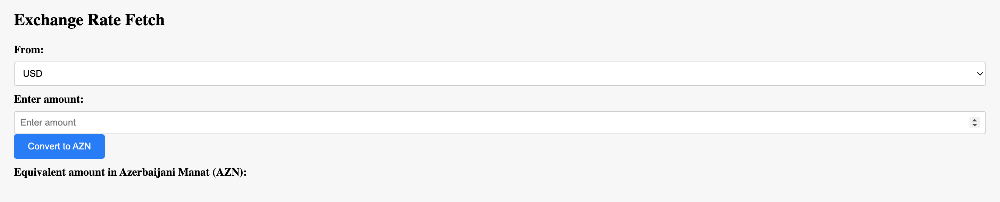

# Currency Conversion Web App

A simple web application for converting currency values using real-time exchange rates.



## Table of Contents

- [Introduction](#introduction)
- [Features](#features)
- [Getting Started](#getting-started)
  - [Prerequisites](#prerequisites)
  - [Installation](#installation)
- [Usage](#usage)
- [Contributing](#contributing)
- [License](#license)

## Introduction

This web application allows users to quickly and easily convert currency values from one currency to another using real-time exchange rates. It provides a user-friendly interface where users can input the amount they want to convert, select the source currency, and then view the equivalent amount in the target currency.

## Features

- Choose from multiple source currencies, including USD and EUR.
- Real-time exchange rates fetched from a reliable API.
- Simple and intuitive user interface.
- Accurate conversion calculations.

## Getting Started

### Prerequisites

- Modern web browser (Google Chrome, Mozilla Firefox, Safari, etc.)

### Installation

1. Clone this repository to your local machine:

   ```sh
   git clone https://github.com/yourusername/currency-conversion-app.git
     
2. Navigate to the project directory:
    ```sh
    cd currency-conversion-app

3. Open the `index.html` file in your preferred web browser.

### Usage
1. Open the web application in your browser by launching the `index.html` file.
2. In the application, choose the source currency from the dropdown menu.
3. Enter the amount you want to convert in the input field.
4. Click the "Convert to AZN" button.
5. The equivalent amount in Azerbaijani Manat (AZN) will be displayed below the button.
### Contributing
Contributions to this project are welcome! If you find any issues or have suggestions for improvements, feel free to create a pull request or submit an issue.

### License

This project is licensed under the MIT License.
[](https://opensource.org/licenses/MIT)